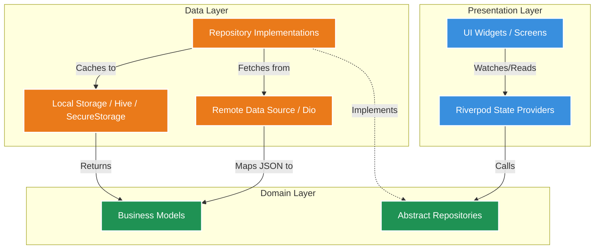

# Architecture Diagram

The GTTP Mobile App strictly uses a **Feature-First Clean Architecture** driven by **Riverpod** for Dependency Injection and State Management.

## Description
- **Presentation Layer:** Contains Flutter Views and Riverpod Providers. The UI never parses JSON or hits APIs directly.
- **Domain Layer:** Contains core business logic, Entities (e.g., `Course`, `Notice`), and Repository Interfaces. This layer is entirely independent of Flutter.
- **Data Layer:** Implements the Domain interfaces. Contains API logic utilizing `Dio` and local caching mechanisms (e.g., `flutter_secure_storage`).
